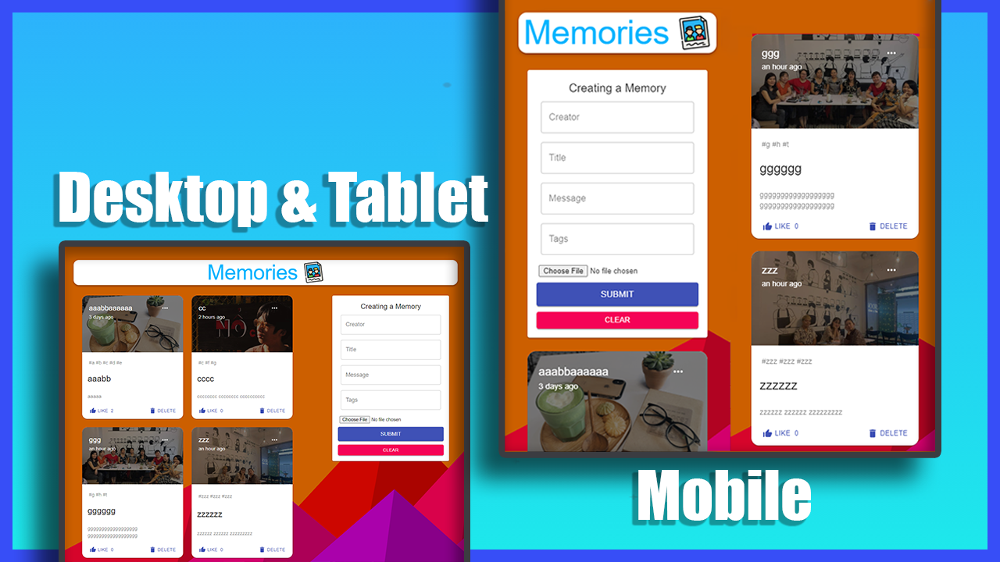

# Mini Project: Memories Application

## Date:

- Part 1 + 2: 02 - Nov - 2020 ~> 08 - Nov - 2020
- Part 3 (Auth): 29 - Jan - 21

### Description

- a simple social media app that allows users to post interesting events that happened in their lives.
- Build and Deploy a Full Stack MERN App
  - React
  - Redux
  - Node
  - Express
  - MongoDB

### Screenshot

- 

### Release

Live Site:

- https://memories.tinspham.info/
- https://memories-application.web.app/

Live Server:

- https://memories-application-server.herokuapp.com/

### Tech-Stack

- Client:

  - react
  - @material-ui/core
  - react-redux
  - redux@4.0.5
  - redux-thunk@2.3.0
  - axios@0.21.0
  - react-file-base64@1.0.3
  - moment@2.29.1
  - jwt-decode@3.1.2
  - react-google-login@5.2.2

- Server:
  - body-parser@1.19.0
  - express@4.17.1
  - mongoose@5.10.11
  - cors@2.8.5
  - nodemon
  - morgan
  - jsonwebtoken@8.5.1
  - bcryptjs@2.4.3

### Plan Of Action

- Initial Project
- Draw Architecture Structure
- Backend Setup
- Frontend Setup
- server: index.js Setup
- MongoDB Setup
- Connecting to the Database in cloud.mongodb
- Routing
- Backend Folder Structure
- Controllers
- JSX Structure
- Styling
- setup Redux
- Form structure JSX
- Create a Post and send to server
- fetch Posts from server and load to UI
- Update Post in server
- Update Post in client
- Delete Post in server
- Delete Post in client
- Like Post in server
- Like Post in client
- Fix UI
- Mobile Responsive
- Environmental Variables
- Deploy `/server` to heroku
- Deploy `/client` to firebase
- Add custom domain to `/client`
- Write `README.md` Document
- Screenshot of UI
- Refactor Layout with router
- Auth UI

### After this project

I have improve my knowledge about

- how to use redux in project
- CRUD in server (CREATE, READ, UPDATE, DELETE)
- separate each models, controllers, routes,
- Deploy client to firebase
- Styles CSS with Material-UI

I have understand about

- how to apply redux thunk to project
- structure with Material-UI
- how to style component with makeStyles
- working with mongoDB
- send database to cloud (cloud.mongodb.com)
- how to send setState of useState to children
- how to count a like of Post in server
- Deploy server to heroku

Bug:

- when update new hashtags of post, but data is updated:

```
error.message TypeError: Cannot destructure property 'data' of '(intermediate value)' as it is undefined.
  at posts.js:24
```

- CAN'T import img that has large size
- Fetch data from heroku is 5s delay.
- when create new post, file attached is not clear

### Next Steps:

- Create Architecture document
- Set limit of post per page, click next page to load more...
- Authentication

### Directory Structure

```
.
├── client
└── server
```

## Installation Guide

### Production

- Clone this project

```
git clone https://github.com/tinspham209/memories-application
```

- cd to `/server`

- Install dependencies

```
npm install
```

- Start the server

```
npm start
```

- cd to `/client`

- Install dependencies

```
npm install
```

- Start the server

```
npm start
```

### Development

- Clone this project
- cd to both: `/client` & `/server`
- Install dependencies

```
npm install
```

- Start packager

```
npm start
```

### How to upgrade project?

- go to both `/client` & `/server`, and read the `README.md` to understand
- If have any question? Email me: tinphamvan123@gmail.com
